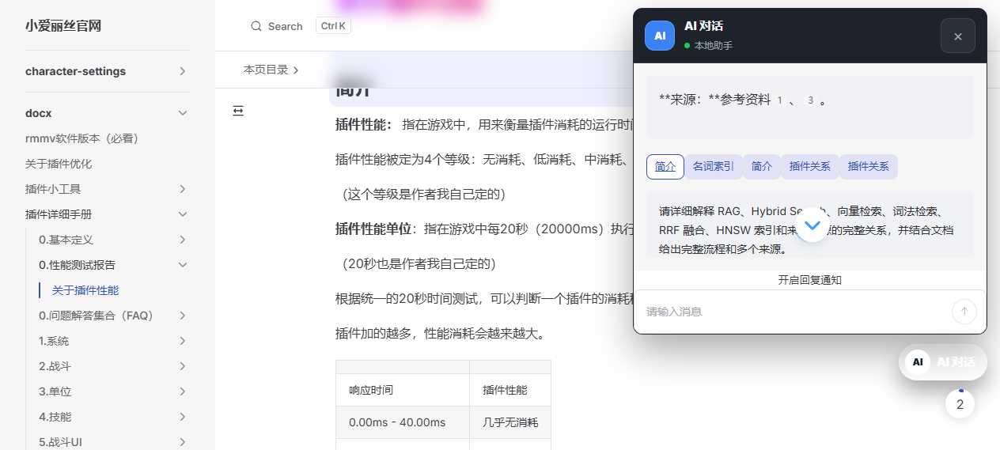

# 你好

[](https://deepwiki.com/ruan-cat/SmallAliceWeb)

你好，这是钻头文档。

## 1. 错误占位图片


> 占位图片说明：docx 转换管线中，当图片转换失败（如损坏的 EMF、异常的 GIF）时回退展示此图。自 2026-08-23 起，**EMF/WMF 矢量图已可真实转换为 PNG**（见第 5 节），占位图仅作为失败兜底，不再是 EMF 图片的常态表现。

## 2. AI RAG 的 Neon 资源标识

二期 AI RAG 复用本仓库关联 Vercel 项目中的既有 Neon 资源，不创建同用途的第二套云数据库。

- Neon 组织 ID：`org-super-fog-48541962`
- Neon 项目 ID：`patient-cloud-43432277`
- Vercel 已关联的 Neon 数据库名称：`neon-smallalice-ai-rag`

数据库连接前，先从 Vercel 拉取当前环境变量；连接串和其他凭据不得提交到仓库。所有 Neon CLI 操作统一使用 `neon`，其安装与认证由用户完成。

## 3. 二期 AI RAG 知识库作品

### 3.1 能力概览

本仓库已经完成一个面向 `docs/docx` 文档的 RAG 知识库闭环：文档变化可增量同步为结构化 chunk，使用 Cloudflare Workers AI 生成 1024 维向量，写入 Neon PostgreSQL 的 pgvector/全文检索索引，再由 Nitro API 提供 Hybrid Search 和流式问答。

- **动态知识同步**：扫描 `docs/docx`，按稳定标题锚点和内容哈希生成 chunk；支持一次同步、监听变更和受鉴权的生产同步入口。
- **结构化检索**：每个结果保留 `sourcePath`、标题路径、`headingAnchor`、`sourceUrl`、图片地址等来源元数据。
- **Hybrid Search**：词法检索、向量检索和 RRF 融合共用同一结果合同；三档真实重切分/重嵌入评测已完成，并包含 HNSW 与精确 Top-5 对照。
- **流式问答与溯源**：`/v1/chat` 使用 Anthropic Messages 流式适配，前端显示回答、停止生成和可点击的来源链接；来源跳转到真实文档的稳定 `#rag-heading-*` 锚点。

### 3.2 架构

```text
docs/docx
  -> 结构化扫描、分块、哈希和稳定锚点
  -> Cloudflare Workers AI @cf/baai/bge-m3（1024 维 embedding）
  -> Neon PostgreSQL（FTS + pgvector + HNSW）
  -> Nitro API（/v1/search、/v1/chat、/v1/knowledge/sync）
  -> VitePress + Element Plus X Chat + @ai-sdk/vue
  -> 流式回答、停止生成、来源锚点跳转
```

### 3.3 技术栈

|       层级       |                                        实现                                        |
| :--------------: | :--------------------------------------------------------------------------------: |
|     知识处理     |                Markdown 扫描、结构化 chunk、内容哈希、稳定标题锚点                 |
|    向量与检索    | Cloudflare Workers AI `@cf/baai/bge-m3`、Neon PostgreSQL、pgvector、HNSW、FTS、RRF |
|      服务端      |               Nitro v3、Drizzle ORM、Zod、AI SDK、Anthropic Messages               |
|     对话界面     |          VitePress、`vue-element-plus-x`、`markstream-vue`、`@ai-sdk/vue`          |
| 部署与运行时验证 |            Vercel Git Integration、Vercel CLI、Chrome/CDP Agent Browser            |

### 3.4 已验证的生产链路

- `POST https://smallalice-docs-ai-nitro-api.ruan-cat.com/v1/search` 已在真实浏览器上下文返回 HTTP 200 和来源 DTO。
- `POST /v1/chat` 已验证流式回答、停止生成后内容和来源保留，以及来源跳转。
- `drill.ruan-cat.com` 的 Git Integration Production deployment 已通过 Vercel CLI 按 main SHA 监听到 READY，再使用 Chrome/CDP 验收。
- 真实参数评测覆盖 `300/30/5`、`500/50/10`、`800/100/15`：`800/100/15` 在固定题集上的 vector/hybrid 命中率为 8/10、关键词覆盖率为 0.70；HNSW/exact Top-5 一致率分别为 8/10、9/10、9/10。

生产浏览器验收截图：



完整评测、部署和浏览器证据见 [OpenSpec change](./openspec/changes/ai-rag-phase2/) 与 [生产浏览器记录](./openspec/changes/ai-rag-phase2/evidence/2026-08-28-production-browser.md)。

### 3.5 已知边界

- 当前对话浮层的视觉层级和信息密度需要后续单独进行 UI 重构；这不影响已验证的检索、流式、停止和来源跳转能力。
- 早期学习计划曾出现 Chroma 本地练习，但它从未进入正式实现，也不属于当前二期交付；正式向量主线唯一是 Neon + pgvector。
- 作品说明以 README 和可复核生产证据为交付物；不再要求录制或外部上传演示视频。

## vercel 项目名称

- 核心 vitepress 文档项目： small-alice-web-odse
- rag nitro 接口项目： smallalice-docs-ai-nitro-api

## 4. Vercel 双项目部署架构

本仓库同时绑定两个 Vercel 项目，采用统一的**仓库根安装 + 产物搬运**模式（`use-vercel-deploy-in-monorepo` 技能的形态 1 模式 A）。

|          Vercel 项目           |       用途       | Root Directory | Framework |                          Build Command                          |    Output Directory    | Install Command | Node |
| :----------------------------: | :--------------: | :------------: | :-------: | :-------------------------------------------------------------: | :--------------------: | :-------------: | :--: |
|     `small-alice-web-odse`     | VitePress 文档站 |      `.`       |   Other   |                        `pnpm run build`                         | `docs/.vitepress/dist` | `pnpm install`  | 22.x |
| `smallalice-docs-ai-nitro-api` |  Nitro API 接口  |      `.`       |   Other   | `pnpm --filter @ruan-cat-drill-doc/ai-rag-api run build:vercel` |    `.vercel/output`    | `pnpm install`  | 22.x |

### 4.1 破坏性变更记录：删除根 `vercel.json`

仓库根 `vercel.json` 已于 2026-08-07 删除（备份在 QoderWork 工作区）。原因：`vercel.json` 会覆盖云端 Project Settings，在同一仓库绑定多个 Vercel 项目时会造成跨项目配置污染。原 `vercel.json` 中的文档站配置已迁移到 `small-alice-web-odse` 的云端 Project Settings，两者值完全一致。

`vercel.old.json` 是更早期 VuePress 的遗留配置，仍指向 `vuepress-vite build docs` 与 `docs/.vuepress/dist`。当前文档站已经使用 VitePress，其构建入口和输出目录分别为 `pnpm run build` 与 `docs/.vitepress/dist`；因此移除该旧文件属于清理过期配置，不会改变当前两个 Vercel 项目的云端 Project Settings，也不得将其恢复为有效部署配置。

### 4.2 CLI 单槽绑定纪律

`.vercel/project.json` 是单槽绑定。**仅当用户明确要求本地 CLI 诊断、应急部署或操作 Nitro API 项目时**，才先 `vercel link --project <name> --yes` 切换到目标项目，再执行本地 `vercel deploy`。`small-alice-web-odse` 的常规文档站 Production 由 Git Integration 触发，不需要也不得借此改走本地上传。

### 4.3 `small-alice-web-odse` 文档站生产发布纪律

文档站的正式生产链路唯一使用 **Git Integration**，不是本地 CLI 上传。开发始终在 `dev` 分支完成；仅当需要真实生产部署和验收时，才按以下顺序执行：

1. 使用全局 `git-commit` 技能审查工作区、按功能/文件类型分组创建有意义的提交。提交前确认 `.gitattributes` 保持二进制文件属性，`.gitignore` 没有遗漏本地生成物或调试垃圾。
2. `git push origin dev`，让 Preview/CI 消费开发提交。
3. 工作树干净后，将 `dev` rebase 到本地 `main`，普通 `git push origin main` 推送 remote `main`，最后切回 `dev`。禁止 force push；不得在 `main` 直接开发。
4. `main` 出现有意义提交即自动触发 `small-alice-web-odse` 的真实 Vercel Production deployment。随后只用 Vercel CLI/MCP 读取 deployment 状态、Git SHA 和构建日志。
5. Production Ready 后，使用本机 Google Chrome 的 Agent Browser 完成功能和视觉验收；先本地转换/本地页面验收，再复测同一生产 URL。

#### 4.3.1 使用 `vercel inspect` 监听 Git Integration 部署

推送 `main` 后，先用目标 deployment ID 或 URL 等待部署收敛，再读取构建日志；不要只看 Dashboard 的瞬时状态，也不要把 `QUEUED` 或 `BUILDING` 当作完成。

```powershell
vercel --version
vercel inspect <deployment-id-or-url> --wait --timeout 3m
vercel inspect <deployment-id-or-url> --logs
```

只有 `inspect --wait` 返回 `status Ready`，且 `inspect --logs` 显示 Git checkout SHA、构建完成与部署完成，才进入 Production URL 的 Google Chrome 验收。命令输出不得包含 API key、数据库连接串或其他凭据。

**禁止**以 `pnpm run deploy-vercel` 或本地 `vercel deploy` 替代上述正式发布链路。CLI `vercel link`/`vercel deploy` 仅适用于另一个项目的显式诊断或已授权应急操作，不是文档站的常规发布动作。

### 4.4 Nitro API 生产域名

- 生产：`https://smallalice-docs-ai-nitro-api.ruan-cat.com/`
- Vercel 默认地址（不使用）：`https://smallalice-docs-ai-nitro-api.vercel.app`
- 路由前缀：`/v1/chat`、`/v1/search`、`/v1/knowledge/sync`、`/v1/knowledge/sync-runs`

### 4.5 Nitro RAG 环境变量

二期 RAG 的 Cloudflare embedding 运行时会读取以下环境变量：

- `NITRO_CLOUDFLARE_ACCOUNT_ID`：`3412269ab0def154c8806e38acd1b493`
- `NITRO_EMBEDDING_MODEL`：`@cf/baai/bge-m3`
- `NITRO_CLOUDFLARE_API_TOKEN`：Cloudflare Workers AI 专用 API token，必须保密；Vercel 的 Production / Preview 使用 Sensitive，Development 受平台限制只能用 Non-sensitive

其中 `ACCOUNT_ID` 可以公开写入文档，`API_TOKEN` 不能提交到仓库。你贴出的 R2/S3 兼容密钥属于另一组云存储凭证，不参与 embedding 接入，也不应写入 README。

## 5. EMF 矢量图转 PNG

docx 源（drill-docx）中的 EMF（Enhanced Metafile）矢量图——主要来自 Excel 图表与 Word 公式，多为 **EMF+ / EMF+ dual** 形态——现在能够在构建管线内真实转换为可阅读的 PNG 图片（自 2026-08-23 上线）。

### 5.1 能力说明

- **转换链路**：`scripts/build-doc-in-vercel/transformers.ts` 的 `docx2html()` 图片回调中，`x-emf` / `emf` / `wmf` 不再走占位图，而是经 `emf-converter`（EMF+/EMF+ dual 记录集完整解析）+ `@napi-rs/canvas`（Skia 渲染）转换为 PNG 落盘，链接显式使用 `.png` 扩展名。
- **覆盖率**：drill-docx 全量 382（GitHub 仓库 403）个 EMF 均为 EMF+（含 dual），转换成功率 100%（本地管线、CI ubuntu、Vercel 生产容器三方验证一致）。
- **中文渲染**：Vercel 容器无任何中文字体，随包携带 OFL 授权的 Noto Sans SC 子集字体（约 199KB）经 `GlobalFonts.registerFromPath` 注册，配合 `fontFamilyMap` 小写键映射（宋体/SimSun/Calibri/Cambria 等 → NotoSansSC），避免文字豆腐块。
- **失败兜底**：转换失败仅影响单张图片（回退占位图 + 记入错误清单 + 计入成功/失败统计），不中断构建。
- **已知限制**：输出为 PNG 光栅（非矢量 SVG）；个别 EMF+ 记录类型（如 record type 90）会被库跳过但仍成功输出；渲染质量受 Canvas 引擎字体度量影响。

### 5.2 相关工件

- 技术设计与实现约束：`openspec/changes/handle-x-emf-img/design.md`
- 任务清单与验证证据：`openspec/changes/handle-x-emf-img/tasks.md` 与 `evidence/`
- 调研报告：`reports/2026-08-22-docx-x-emf-conversion-research.md`

### 5.3 历史背景

2025-02 曾尝试纯 Node 处理 EMF 失败（sharp/libvips 无 EMF 解码器、浏览器不渲染 `image/x-emf`、npm 生态当时无 EMF+ 渲染实现）；2026 年 `emf-converter`（Apache-2.0）+ `@napi-rs/canvas`（零系统依赖预编译二进制）组合落地，实现 Windows 本地与 Vercel 容器同一套代码的运行形态。
