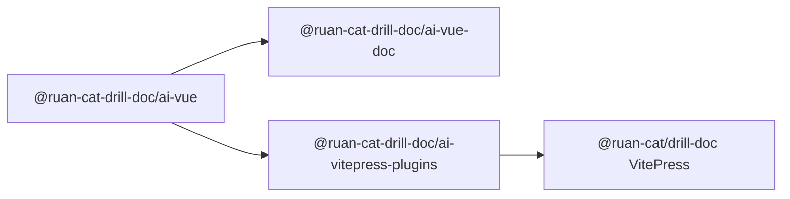
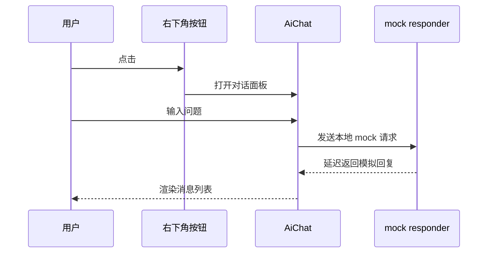

# 2026-07-22 AI 对话组件三包一期设计

## 1. 背景与目标

本项目要在 `@ruan-cat/drill-doc` 文档体系中打下 AI 对话组件的基础架构。目标不是一次性完成真实大模型、RAG、后端服务或 LangGraph 流程，而是先把 monorepo 多包调度、Vue 组件库、Nuxt 组件库文档站、VitePress 客户端插件接入链路跑通。

一期用户可见结果是：在根 VitePress 文档站右下角出现 AI 圆形入口按钮，点击后打开对话窗口，用户能输入问题并得到模拟 AI 回复。Nuxt 文档站也能展示同一个组件库组件，并能完成同样的模拟交互。

## 2. 已确认决策

|        决策项        |                      一期结论                       |
| :------------------: | :-------------------------------------------------: |
|       子包数量       |                      三个子包                       |
|  `ai-vue` 能力边界   |        只做 mock AI 对话前端壳，不接真实后端        |
| Nuxt / VitePress SSR |      页面 shell SSR 正常，对话主体 client-only      |
|  VitePress 插件形态  | 客户端主题插件 / theme enhancer，不做 Vite 构建插件 |
|    真实 LLM / RAG    |             全部放到后续 OpenSpec 阶段              |
|    工作区物理路径    |          使用 `packages/ai-vue` 等扁平目录          |

## 3. 一期范围

### 3.1. `@ruan-cat-drill-doc/ai-vue`

`ai-vue` 是基础 Vue 组件库，负责暴露 AI 对话相关业务组件和 Vue plugin。它应包含：

- `AiChat`：核心对话窗口组件。
- `AiChatFloatingButton`：右下角圆形入口按钮。
- mock 消息生成逻辑：模拟思考、流式感知或延迟回复，但不请求外部接口。
- 类型定义：消息、角色、发送参数、组件 props、emit。
- 样式入口：`@ruan-cat-drill-doc/ai-vue/styles`。
- Vue plugin：默认导出 `{ install }`，支持 `app.use(AiVue)`。

`ai-vue` 不包含：

- `baseUrl`、API key、模型名称等真实服务配置。
- Nitro route、Node server、Cloudflare Worker、LangGraph、向量库或 RAG 抽象。
- 文档站专用逻辑。

### 3.2. `@ruan-cat-drill-doc/ai-vue-doc`

`ai-vue-doc` 是 Nuxt + `shadcn-docs-nuxt` 组件库文档站。它负责证明 `ai-vue` 可在 SSR 项目中被安全消费。

它应高度参考 `D:\code\ruan-cat\eams-component-lib\packages\vue-element-cui-nuxt`：

- `package.json` 脚本保留 `predev`、`prebuild`、`postinstall` 的 `nuxt prepare`。
- `nuxt.config.ts` 保留 `extends: ["shadcn-docs-nuxt"]`。
- workspace alias 指向 `../ai-vue/src/index.ts` 和 `../ai-vue/src/styles/index.scss`，不依赖 `ai-vue` 先 build。
- `tailwind.config.js` 扫描 `../../node_modules/shadcn-docs-nuxt/**/*.{vue,js,ts,mjs}`。
- 插件 `plugins/ai-vue.ts` 安装底层 UI 依赖和 `AiVue`。

### 3.3. `@ruan-cat-drill-doc/ai-vitepress-plugins`

`ai-vitepress-plugins` 是 VitePress 客户端集成包。它不负责 Markdown 转换或构建期插件能力，一期只提供 VitePress theme 层可用的 Vue plugin 与样式。

推荐导出结构：

|        子路径        |                  作用                   |
| :------------------: | :-------------------------------------: |
|         `.`          |  导出主安装函数与类型，兼容普通 import  |
|      `./client`      | 导出 VitePress 客户端 Vue plugin 和组件 |
| `./client/style.css` |   导出 VitePress 悬浮按钮和 dock 样式   |
|   `./components/*`   |    可选导出单组件，便于后续按需注册     |

根 VitePress 项目通过 `docs/.vitepress/theme/index.ts` 的 `enhanceApp({ app })` 安装客户端插件，并通过 `ClientOnly` 或客户端挂载策略显示 AI 对话主体。

## 4. 架构设计

### 4.1. 包关系

`ai-vue` 是唯一组件能力源。Nuxt 文档站和 VitePress 插件都只能消费它，不复制组件实现。

### 4.2. 数据流

mock responder 必须是可替换的局部函数或 composable，但不能抽象成真实 API client。后续真实能力进入时，再由新的 OpenSpec change 扩展。

### 4.3. SSR 策略

Nuxt 与 VitePress 的页面外壳必须能完成 SSR 构建。AI 对话主体一期使用 client-only 策略：

- 顶层模块不访问 `window`、`document`、`localStorage`、`navigator`。
- 与浏览器状态相关的逻辑放在 `onMounted` 或客户端组件内。
- 时间、随机数、滚动容器高度等会造成 hydration mismatch 的值，不参与服务端 HTML 输出。
- VitePress 根站点只要求 SSR shell 成功和客户端交互成功，不要求对话消息在 SSR HTML 中预渲染。

## 5. 依赖策略

### 5.1. 一期推荐依赖

|          包          |         用途         |               一期策略               |
| :------------------: | :------------------: | :----------------------------------: |
|        `vue`         |     Vue 组件基础     |           peer dependency            |
|    `element-plus`    |  UI 基础样式和控件   |           peer dependency            |
| `vue-element-plus-x` | AI 对话组件能力参考  |   优先二次封装，不直接暴露内部细节   |
|    `@ai-sdk/vue`     | 后续真实请求状态管理 |    一期不接入，留到真实 LLM 阶段     |
|  `ai-elements-vue`   |  shadcn-vue AI 组件  |      一期不接入，避免双设计系统      |
|   `markstream-vue`   |  流式 Markdown 渲染  |  一期不接入，后续按真实流式需求评估  |
|  `@shikijs/stream`   |     流式代码高亮     | 一期不接入，后续按 Markdown 需求评估 |

### 5.2. 兼容策略

`vue-element-plus-x` 依赖 Element Plus、`@vueuse/core` 等包，Nuxt 文档站和 VitePress 构建可能遇到 SSR 外部化问题。执行阶段需要从 eams 的 Nuxt 配置复制核心思路，但按本项目依赖树收敛名单：

- Nuxt 文档站优先配置 `vite.ssr.noExternal` 和 `nitro.externals.inline`。
- VitePress 根站点优先在 `docs/.vitepress/config.mts` 的 `vite.ssr.noExternal` 中加入本地插件包、`ai-vue`、Element Plus 相关依赖。
- 出现具体构建错误后再补充依赖名单，不预先堆完整无关列表。

## 6. 验收标准

### 6.1. 组件库验收

- `pnpm --filter @ruan-cat-drill-doc/ai-vue build` 通过。
- `pnpm --filter @ruan-cat-drill-doc/ai-vue test` 通过。
- `dist` 产物包含根入口、样式入口和类型声明。
- `AiChat` 能完成用户消息追加、mock 回复追加、loading 状态切换。

### 6.2. Nuxt 文档站验收

- `pnpm --filter @ruan-cat-drill-doc/ai-vue-doc dev` 可访问首页。
- `pnpm --filter @ruan-cat-drill-doc/ai-vue-doc build` 通过。
- `pnpm --filter @ruan-cat-drill-doc/ai-vue-doc preview` 可访问构建产物。
- 浏览器中能看到 `AiChat` 演示并完成 mock 对话。
- 控制台无 `window is not defined`、hydration mismatch、模块导入阻断错误。

### 6.3. VitePress 插件验收

- `pnpm --filter @ruan-cat-drill-doc/ai-vitepress-plugins build` 通过。
- `pnpm --filter @ruan-cat-drill-doc/ai-vitepress-plugins test` 通过。
- `pnpm run docs:dev` 中根文档右下角出现圆形 AI 按钮。
- 点击按钮后出现对话窗口并完成 mock 对话。
- `pnpm run docs:build` 通过。
- 浏览器自测优先使用 agent-browser；无法使用时再用 Chrome MCP 或其他可视化方式。

## 7. 风险与处理

### 7.1. 包数量描述冲突

用户原文出现“两个子包”和三个命名包并存。已按命名清单收敛为三个子包，因为命名清单更具体，且 VitePress 插件包职责独立。

### 7.2. 一期范围膨胀

真实 LLM、RAG、Nitro API、LangGraph、向量库、baseUrl 配置全部禁止进入一期。若执行中发现需要这些能力，先写入 OpenSpec 后续任务，不在当前实现中顺手添加。

### 7.3. SSR 与 hydration

对话主体 client-only 是一期硬约束。任何导致服务端渲染访问浏览器 API 的实现，都应被复核代理退回。

### 7.4. 设计系统混用

一期优先走 Element Plus X，不同时引入 `ai-elements-vue`。如果未来要切到 shadcn-vue 风格，需要单独规格设计，不能在本次混用。

## 8. 参考依据

- 当前根包：`D:\code\ruan-cat\SmallAliceWeb\package.json`
- 当前 VitePress 配置：`D:\code\ruan-cat\SmallAliceWeb\docs\.vitepress\config.mts`
- 当前 VitePress 主题入口：`D:\code\ruan-cat\SmallAliceWeb\docs\.vitepress\theme\index.ts`
- eams 组件库包：`D:\code\ruan-cat\eams-component-lib\packages\vue-element-cui`
- eams Nuxt 文档站：`D:\code\ruan-cat\eams-component-lib\packages\vue-element-cui-nuxt`
- VitePress 官方主题扩展文档：`https://vitepress.dev/guide/extending-default-theme`
- Nolebase VitePress 插件包结构：`https://github.com/nolebase/integrations`
- okineadev VitePress LLM 插件包结构：`https://github.com/okineadev/vitepress-plugin-llms`
